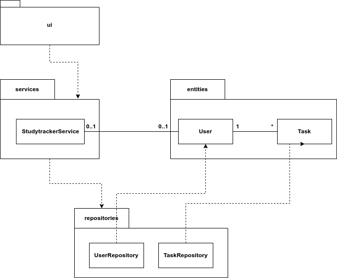
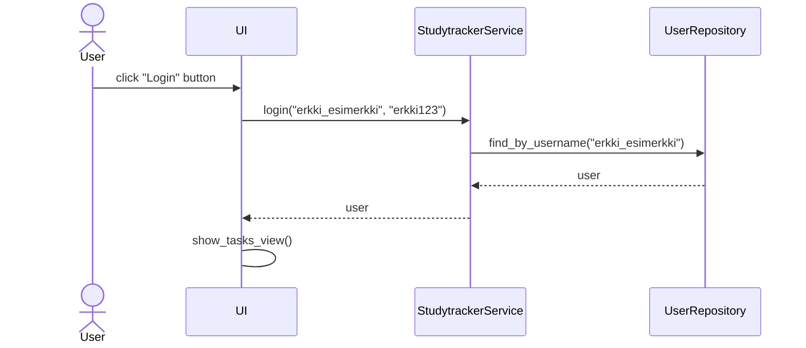

# Arkkitehtuurikuvaus

## Rakenne

## Päätoiminnallisuudet

Valikoitujen päätoiminnalisuuksien kuvaus sekvenssikaavioina

### Käyttäjän kirjautuminen

```mermaid
sequenceDiagram
  actor User
  participant UI
  participant StudytrackerService
  participant UserRepository
  User->>UI: click "Login" button
  UI->>StudytrackerService: login("erkki_esimerkki", "erkki123")
  StudytrackerService->>UserRepository: find_by_username("erkki_esimerkki")
  UserRepository-->>StudytrackerService: user
  StudytrackerService-->>UI: user
  UI->UI: show_tasks_view()
```