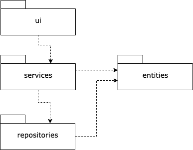

# Arkkitehtuurikuvaus

## Rakenne

Ohjelman rakenne noudattaa kolmitasoista kerrosarkkitehtuuria, jossa koodin pakkausrakenne on seuraava:

Koodi on jaettu pakkauksiin seuraavasti:

- _ui_ sisältää käyttöliittymästä vastaavan koodin
- _services_ sisältää sovelluslogiikasta vastaavan koodin
- _repositories_ sisältää tietojen pysyväistallennuksesta vastaavan koodin
- _entities_ sisältää luokkia, jotka kuvastavat sovelluksen käyttämiä tietokohteita

## Käyttöliittymä

Käyttöliittymä sisältää kolme erillistä näkymää:

- Kirjautuminen
- Käyttäjätunnuksen luominen
- Tehtävälistauksen, jonka voi filteröidä näyttämään tekemättömät (oletus), tehdyt tai kaikki

Näkymät on toteutettu omina luokkinaan ja kukin näkymä näkyy käyttäjälle kerrallaan. Näkymien näyttämisestä vastaa [UI](../src/ui/ui.py)-luokka. Käyttöliittymä on pyritty eristämään täysin sovelluslogiikasta. Käyttöliittymä kutsuu ainoastaan [StudytrackerService](../src/services/studytracker_service.py)-luokan metodeja.

## Sovelluslogiikka

Sovelluksen loogisen tietomallin muodostavat luokat [User](https://github.com/miikuel/ot-harjoitustyo/blob/main/src/entities/user.py) ja [Task](https://github.com/miikuel/ot-harjoitustyo/blob/main/src/entities/task.py), jotka kuvaavat käyttäjiä ja käyttäjien tehtäviä:

Toiminnallisista kokonaisuuksista vastaa luokan [StudytrackerService](https://github.com/miikuel/ot-harjoitustyo/blob/main/src/services/studytracker_service.py) ainoa olio. Luokka tarjoaa käyttäliittymän toiminnoille omat metodit, joita ovat esimerkiksi:

- `login(username, password)`
- `create_user(username, password)`
- `create_task(topic, category, deadline)`
- `find_users_tasks()`
- `set_task_done(task_id)`

`StudytrackerService`-luokan ja ohjelman muiden osien suhdetta kuvaava luokka/pakkauskaavio:

## Tietojen pysyväistallennus

Pakkauksen repositories luokat TaskRepository ja UserRepository huolehtivat tietojen tallettamisesta. Molemmat luokat tallentavat tiedot SQLite-tietokantaan.

Luokat noudattavat Repository -suunnittelumallia ja ne voidaan tarvittaessa korvata uusilla toteutuksilla, jos tietojen tallennustapaa päätetään muuttaa.

Käyttäjät tallennetaan SQLite-tietokannan tauluun users ja tehtävät tauluun tasks. Tietokanta alustetaan initialize_database.py-tiedostossa.

## Päätoiminnallisuudet

Valikoitujen päätoiminnalisuuksien kuvaus sekvenssikaavioina

### Käyttäjän kirjautuminen

