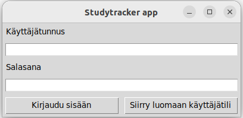
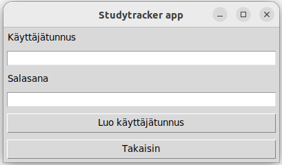
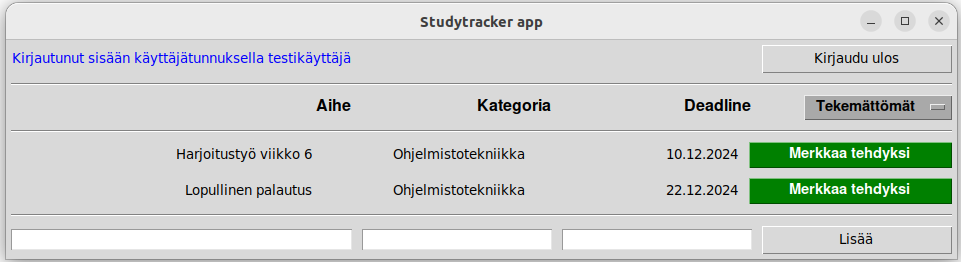
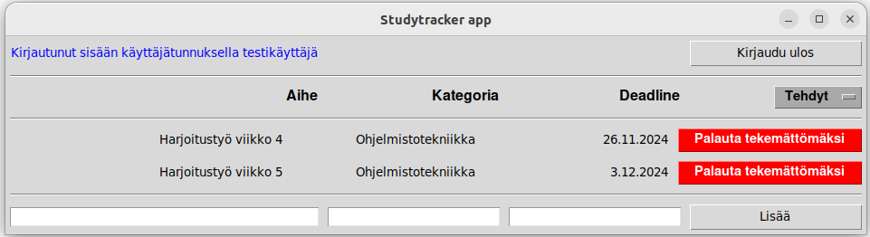
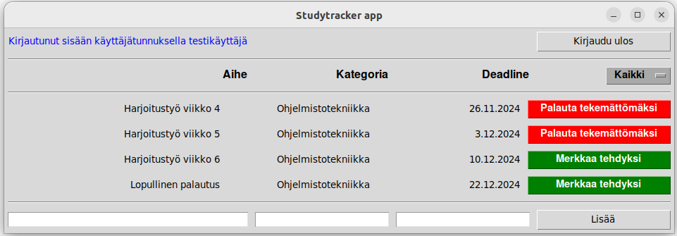

# Käyttöohje

Lataa projektin viimeisimmän [releasen](https://github.com/miikuel/ot-harjoitustyo/releases) lähdekoodi valitsemalla _Assets_-osion alta _Source code_.

## Ohjelman käynnistäminen

1. Asenna riippuvuudet komennolla:

```bash
poetry install
```

2. Suorita vaadittavat alustustoimenpiteet komennolla:

```bash
poetry run invoke build
```

3. Käynnistä ohjelma komennolla:

```bash
poetry run invoke start
```

## Kirjautuminen

Sovellus käynnistyy kirjautumisnäkymään:



Kirjautuminen onnistuu kirjoittamalla käyttäjätunnus ja salasana syötekenttiin ja klikkaamalla "Kirjaudu sisään"-painiketta.

## Uuden käyttäjätilin luominen

Kirjautumisnäkymästä voi siirtyä uuden käyttäjätilin luomisnäkymään painikkeella "Siirry luomaan käyttäjätili".

Uusi käyttäjä luodaan syöttämällä tiedot syötekenttiin ja painamalla "Luo käyttäjätunnus"-painiketta:



Jos käyttäjän luominen onnistuu, siirrytään takaisin kirjautumisnäkymään.

## Tehtävien luominen ja tehdyksi merkkaaminen

Onnistuneen kirjautumisen myötä siirrytään näkymään, jossa on listattuna käyttäjän tekemättömät tehtävät:



Tehtävän voi merkata tehdyksi painikkeella "Merkkaa tehdyksi". Uusia tehtäviä on mahdollista lisätä kirjoittamalla syötekenttiin aihe, kategoria ja deadline ja painamalla "Lisää"-painiketta.

## Tehdyksi merkattujen tehtävien tarkastelu ja palauttaminen tekemättömäksi

Oikeassa laidassa olevasta dropdown valikosta voi vaihtaa tehtävänäkymää. Oletuksena näytetään tekemättömät tehtävät, mutta tarkastelu onnistuu myös tehtyjen tai kaikkien tehtävien osalta:

Tehdyt:



Kaikki:



Tehtävän voi palauttaa tekemättömäksi painikkeella "Palauta tekemättömäksi".

## Uloskirjautuminen

Oikean ylänurkan painiketta "Kirjaudu ulos" klikkaamalla käyttäjä kirjautuu ulos sovelluksesta ja sovellus palaa takaisin kirjaantumisnäkymään.