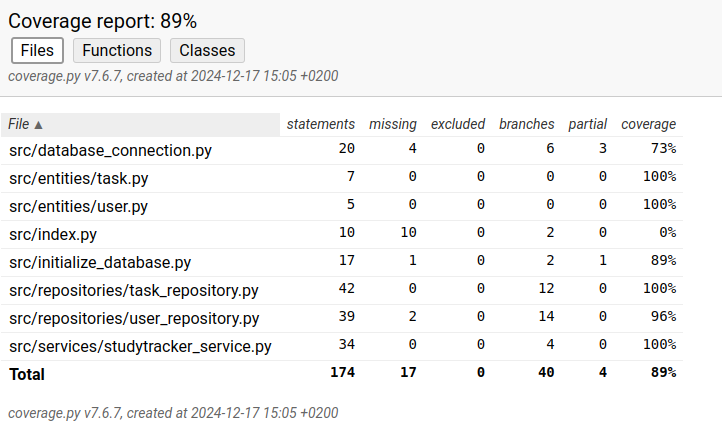

# Testausdokumentti

Sovellusta on testattu automatisoidusti yksikkö- ja integraatiotestein unittest-kirjastoa käyttäen. Lisäksi on tehty järjestelmätason testausta manuaalisesti.

## Yksikkö- ja integraatiotestaus

### Sovelluslogiikka

Sovelluslogiikasta vastaavaa `StudytrackerService`-luokkaa testataan [TestStudytrackerService](https://github.com/miikuel/ot-harjoitustyo/blob/main/src/tests/services/studytarcker_service_test.py)-testiluokalla. `StudytrackerService`-olio alustetaan normaaliin tapaan ja testeissä käytetään omaa testitietokantaa sovelluksen varsinaisen tietokannan sijasta

### Repositorio-luokat

`TaskRepository`-luokkaa testataan [TestTaskRepository](https://github.com/miikuel/ot-harjoitustyo/blob/main/src/tests/repositories/task_repository_test.py)-testiluokalla ja `UserRepository`-luokkaa [TestUserRepository](https://github.com/miikuel/ot-harjoitustyo/blob/main/src/tests/repositories/user_repository_test.py)-testiluokalla. Molempien luokkien oliot alustetaan normaaliin tapaan ja testeissä käytetään omaa testitietokantaa sovelluksen varsinaisen tietokannan sijasta

### Testauskattavuus

Käyttöliittymäkerrosta lukuunottamatta sovelluksen testauksen haarautumakattavuus on 89%

## Järjestelmätestaus

Sovelluksen järjestelmätestaus suoritettiin manuaalisesti.

### Asennus ja konfigurointi

Sovellus on ladattu GitHubista ja sitä on testattu [käyttöohjeen](./kayttoohje.md) kuvaamalla tavalla Linux-ympäristössä.

### Toiminnallisuudet

Kaikki [määrittelydokumentissa](./vaatimusmaarittely.md) ja [käyttöohjeessa](./kayttoohje.md) listatut toiminnallisuudet on käyty läpi. Sovellusta on testattu myös virheellisillä syötteillä, kuten tyhjillä arvoilla.

## Sovellukseen jääneet laatuongelmat

Sovellus ei anna tällä hetkellä järkeviä virheilmoituksia, seuraavissa tilanteissa:

- SQLite tietokantaa ei ole alustettu, eli `poetry run invoke build`-komentoa ei ole suoritettu