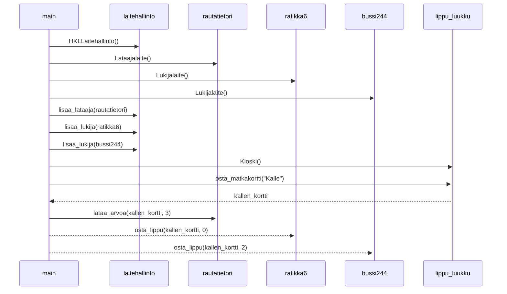

```mermaid
sequenceDiagram
    participant main
    participant laitehallinto
    participant rautatietori
    participant ratikka6
    participant bussi244
    participant lippu_luukku

    main->>laitehallinto: HKLLaitehallinto()
    activate laitehallinto

    main->>rautatietori: Lataajalaite()
    activate rautatietori
    main->>ratikka6: Lukijalaite()
    activate ratikka6
    main->>bussi244: Lukijalaite()
    activate bussi244

    main->>laitehallinto: lisaa_lataaja(rautatietori)
    main->>laitehallinto: lisaa_lukija(ratikka6)
    main->>laitehallinto: lisaa_lukija(bussi244)

    main->>lippu_luukku: Kioski()
    activate lippu_luukku
    main->>lippu_luukku: osta_matkakortti("Kalle")
    lippu_luukku-->>main: kallen_kortti
    main->>rautatietori: lataa_arvoa(kallen_kortti, 3)
    main-->>ratikka6: osta_lippu(kallen_kortti, 0)
    main-->>bussi244: osta_lippu(kallen_kortti, 2)
```