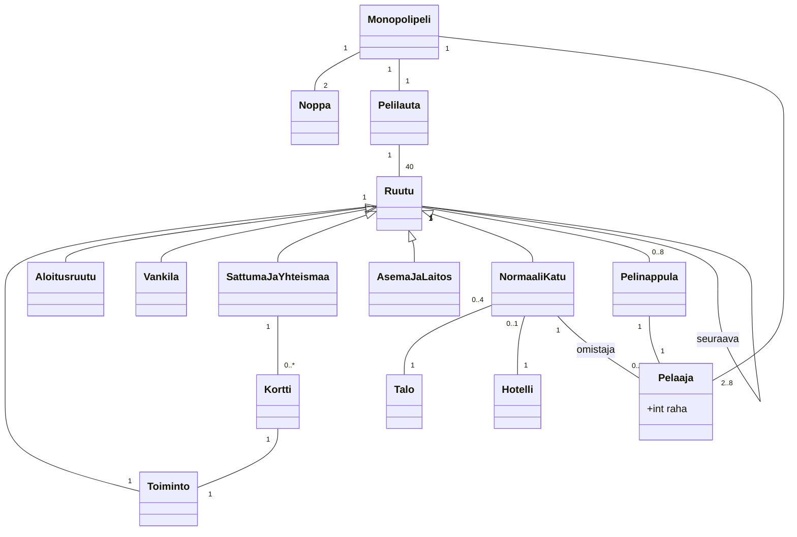

```mermaid
 classDiagram
    Monopolipeli "1" -- "2" Noppa
    Monopolipeli "1" -- "1" Pelilauta
    Pelilauta "1" -- "40" Ruutu
    Ruutu "1" -- "1" Toiminto
    Ruutu <|-- Aloitusruutu
    Ruutu <|-- Vankila
    Ruutu <|-- SattumaJaYhteismaa
    Ruutu <|-- AsemaJaLaitos
    Ruutu <|-- NormaaliKatu
    SattumaJaYhteismaa "1" -- "0..*" Kortti
    Kortti "1" -- "1" Toiminto
    NormaaliKatu "0..4" -- "1" Talo
    NormaaliKatu "0..1" -- "1" Hotelli
    NormaaliKatu "1" -- "0..1" Pelaaja : omistaja
    Pelaaja "2..8" -- "1" Monopolipeli
    Pelaaja : +int raha
    Pelinappula "1" -- "1" Pelaaja
    Ruutu "1" -- "0..8" Pelinappula
    Ruutu "1" -- "1" Ruutu : seuraava
```